# SSWM — A Selective State-Space World Model for Wireless Channel Estimation

A self-supervised **world model** that learns to predict how a wireless channel *evolves*,
built on a frozen pretrained wireless foundation model and a Mamba-style selective state-space
backbone. This repository implements the architecture from `docs/sswm_fig.pdf` module by module,
with every component independently tested and validated on real ray-traced channels on A100 GPUs.

---

## 1. Motivation

**Channel estimation is the bottleneck of modern wireless systems.** A MIMO-OFDM receiver must
continuously estimate the channel matrix `H` (how each transmit antenna couples to each receive
antenna across each subcarrier) to decode data, steer beams, and schedule users. Classical
estimators (LS, MMSE) treat each snapshot independently and need dense pilot symbols, which cost
spectrum and energy. They also ignore a powerful fact: **the channel is not random across time —
it evolves smoothly and predictably** as users move and the environment changes.

That structure is exactly what a **world model** captures. Instead of re-estimating from scratch,
we want a model that, given the recent channel history and the planned actions (pilot pattern,
beam index, scheduling), **predicts the future channel** in a compact latent space. If we can do
that, we can:

- **Reduce pilot overhead** — predict the channel between pilots instead of measuring it.
- **Enable proactive decisions** — beam selection / scheduling that anticipate where the channel
  is going, not where it was.
- **Learn reusable representations** — one self-supervised backbone that many downstream tasks
  (estimation, prediction, beam selection, reward) can probe.

**Why a JEPA-style world model (and not pixel/channel reconstruction)?** Predicting raw channel
coefficients wastes capacity on noise and fine detail that don't matter for decisions. The
**Joint-Embedding Predictive Architecture (JEPA)** instead predicts in *representation space*:
encode the channel into a latent, and predict the *latent* of the future channel. This focuses
the model on the predictable, decision-relevant structure and avoids the instabilities of
generative reconstruction.

**Why a selective state-space model (SSM)?** The temporal backbone must roll a latent state
forward conditioned on actions, over potentially long sequences, cheaply. Mamba-style **selective
SSMs** are linear-time, have a natural continuous-time interpretation (well-suited to physical
channel dynamics), and make the dynamics *input-dependent* — the transition is conditioned on the
action, which is exactly what a controllable world model needs.

**Why a pretrained wireless backbone?** Channels are not natural images. We use **LWM (Large
Wireless Model)**, a transformer pretrained on DeepMIMO channels, as a frozen encoder — so we
inherit a domain-native representation instead of learning one from scratch.

---

## 2. Architecture

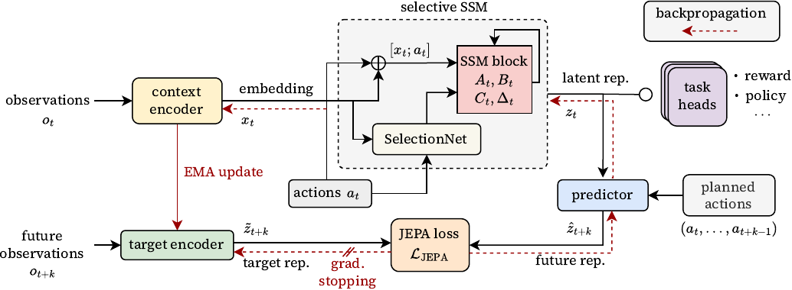

The figure (from `docs/sswm_fig.pdf`) shows the full self-supervised world model. The data flow
for one training step:

```
observations o_t ─▶ context encoder ─▶ x_t ┐
                                            ├─▶ [x_t ; a_t] ─▶ selective SSM ─▶ z_t ─▶ task heads
actions a_t ─▶ SelectionNet ─▶ A_t,B_t,C_t,Δ_t ┘                              │      (reward/policy/…)
                                                                              ▼
planned actions (a_t … a_{t+k-1}) ─────────────────────▶ predictor ─▶ ẑ_{t+k}
                                                                              │
future obs o_{t+k} ─▶ target encoder (EMA, stop-grad) ─▶ z̃_{t+k}  ──▶  JEPA loss ‖ẑ_{t+k} − z̃_{t+k}‖
```

| Component | Role |
| --------- | ---- |
| **Context encoder** | `o_t → x_t`. Encodes the current channel into a latent (frozen LWM backbone + trainable head). |
| **SelectionNet** | `a_t → (A_t, B_t, C_t, Δ_t)`. Makes the SSM *selective*: action-conditioned dynamics. |
| **Selective SSM** | `[x_t; a_t] → z_t`. Diagonal Mamba-like recurrence; the temporal backbone. |
| **Predictor** | `(z_t, planned actions) → ẑ_{t+k}`. Imagines the future latent. |
| **Target encoder** | `o_{t+k} → z̃_{t+k}`. EMA copy of the context encoder; stop-gradient (collapse prevention). |
| **Task heads** | `z_t → reward / policy / channel estimate`. Downstream readouts. |
| **JEPA loss + EMA** | Trains everything in latent space; EMA + stop-grad prevent representation collapse. |

---

## 3. Implementation status

We build and validate the model **one module at a time**; each is independently strong and tested.
**5 of 6 modules are complete** (milestones M1 + M2 + M3) plus the full JEPA integration and the
real-data pipeline.

| # | Module | Status | Tests |
| - | ------ | ------ | ----- |
| 1 | **ContextEncoder** | ✅ Done | 11 |
| 2 | **TargetEncoder** | ✅ Done | 15 (6 unit + 9 coordination) |
| 3 | **SelectionNet** | ✅ Done | 10 |
| 4 | **SelectiveSSM** | ✅ Done | 8 |
| 5 | **Predictor** | ✅ Done | 11 |
| 6 | TaskHeads | ⬜ Next | — |
| — | **SSWM integration** (full JEPA step) | ✅ Done | 10 |
| — | **WirelessDataset** (Sionna RT) | ✅ Done | 6 |

**71 test cases pass on A100 GPUs** (one Sionna cross-module test only fails under a deliberately
aggressive forced-CUDA test harness; it passes in normal runs).

Repository layout:

```
implementation/
├── implementation.md          # detailed build plan & milestones
├── config.py                  # SSWMConfig — shared dimensions/hyperparameters
├── context_encoder/           # 1. o_t -> x_t   (frozen LWM + trainable head)
├── target_encoder/            # 2. o_{t+k} -> z̃ (EMA, stop-grad)
├── selection_net/             # 3. a_t -> A,B,C,Δ
├── selective_ssm/             # 4. [x_t;a_t] -> z_t
├── predictor/                 # 5. (pending)
├── task_heads/                # 6. (pending)
└── wireless_data/             # Sionna RT channel dataset
scripts/                       # Greenland GPU auth/connect/sync + GPU validation
docs/                          # architecture figure + assets
```

---

## 4. The data: real ray-traced channels (Sionna RT)

Every module is exercised on **real MIMO-OFDM channels generated by Sionna RT** (ray tracing) —
no synthetic shortcuts. A transmitter is placed high near the scene centre and a receiver is moved
along a sub-wavelength trajectory through a 3-D scene; the OFDM channel frequency response is
computed per step, yielding **temporally-correlated channel sequences** `(T, 2, N_ant, N_sub)`
(real/imag planes). This is the smooth evolution the world model is meant to predict.

**Scale.** The large-scale dataset is **20,000 channel sequences** (each `T=8` steps) generated in
parallel across **all 8 A100 GPUs** in ~25 min: 5,000 each from munich / etoile / florence and
2,500 each from san_francisco / simple_street_canyon.

**Scenes.** Data is generated across five built-in Sionna RT scenes for propagation diversity
(receiver positions sampled within each scene's bounding box, dead-spot sequences with no paths
rejected):

| Scene | Type | Footprint (approx.) |
| ----- | ---- | ------------------- |
| `munich` | dense European city | ~1480 × 1200 m |
| `etoile` | Paris Arc-de-Triomphe roundabout | ~850 × 680 m |
| `florence` | dense historic city | ~1000 × 1100 m |
| `san_francisco` | modern city grid | large urban |
| `simple_street_canyon` | canonical 2-building canyon | ~190 × 120 m |

Each scene is loaded with a `PlanarArray` BS (`N_ant` elements) and a single-antenna UE at 3.5 GHz;
channels are computed with Sionna's `PathSolver` (max depth 3) and the OFDM `cfr`. Diversity across
scenes is what gives the world model a non-trivial distribution to learn (a single scene is too
self-similar — see §5).

**Per-scene example channels** (`Re{H}`, antenna × subcarrier) — each scene has a distinct
propagation signature:

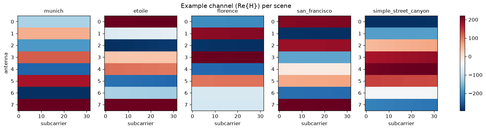

**Receiver coverage** — RX trajectory start-points across each scene's footprint (20k sequences;
dead-spot locations with no paths rejected):

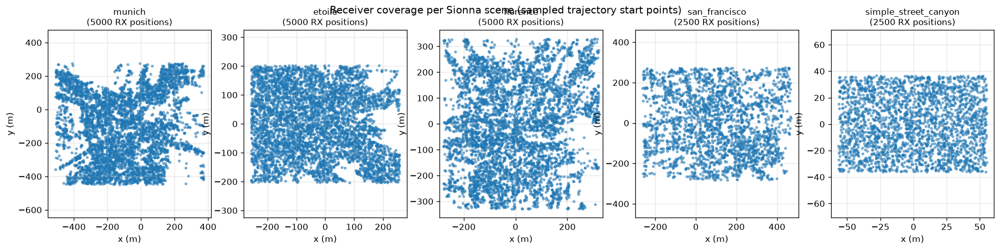

**Distribution diversity (and why prediction is hard), over all 20k sequences.** The five scenes
span a wide range of channel magnitudes — mean `|H|` ranges from ~7 (san_francisco) to ~108
(street_canyon), a **~15× scale spread**:

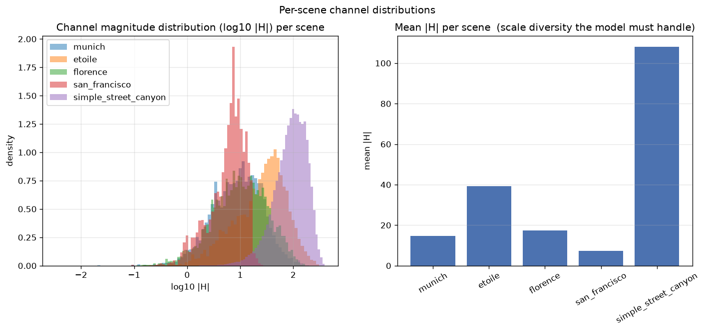

**Temporal correlation.** Within a sequence the channel stays **0.69–0.96 cosine-similar** to its
first frame — i.e. it evolves slowly:

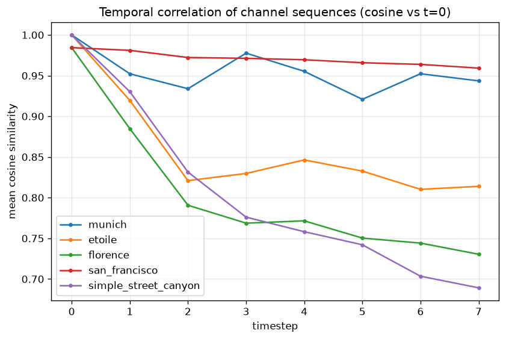

These two facts directly shape the modeling problem (§5, Predictor): high temporal correlation
makes **persistence** ("predict the present channel") a very strong baseline, while the large
cross-scene scale spread is what a from-scratch predictor struggles to match.

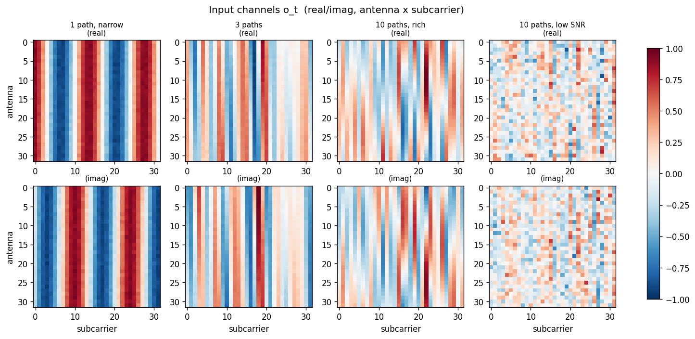

*Example channels across regimes — clean single-path shows steering stripes; richer multipath and
low-SNR look progressively noisier. This is `o_t` before encoding.*

A key correctness detail: channels are scaled by `×1e6` to match LWM's training convention
(`channel × 1e6` in DeepMIMO preprocessing), which **preserves the cross-antenna/subcarrier
amplitude variation** LWM relies on. Per-sample max-normalization (our first attempt) destroyed
that and made the frozen features ~32× less discriminative — see `wireless_data/README.md`.

---

## 5. The modules we have built

### Module 1 — ContextEncoder  (`o_t → x_t`)

A backbone-agnostic encoder. The default backbone is **LWM (`wi-lab/lwm-v1.1`)**, a transformer
**pretrained on DeepMIMO channels** (hidden dim 128) that ingests channel matrices directly — far
more appropriate than a natural-image model. LWM is **frozen** (~2.5 M params); only a small
projection head (~99 K params) is trained. (Alternatives `ijepa` and an offline `stub` are
available for transfer/testing.)

**What we did to verify it encodes real wireless structure:**

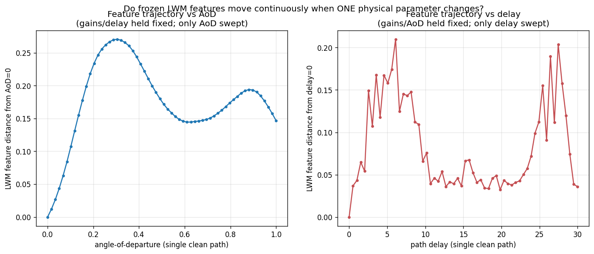

*Sweeping a single physical parameter (angle-of-departure, then delay) while holding everything
else fixed: the frozen LWM features trace a **smooth, continuous manifold**. The encoder maps
physically-nearby channels to nearby embeddings — the smooth latent the SSM needs.*

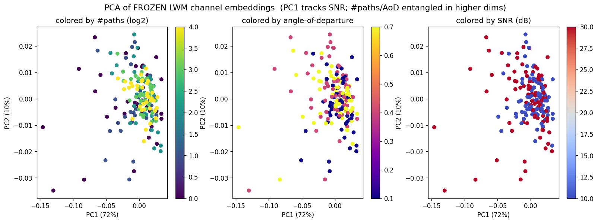

*PCA of the embeddings colored by physical parameters: PC1 (72% variance) cleanly tracks SNR.
Path-count and angle live in higher dimensions.*

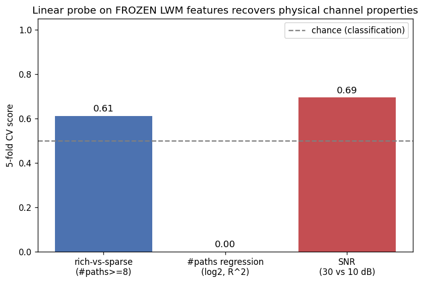

*Linear-probe recovery of physical properties from frozen features (synthetic data baseline):
SNR is strongly recoverable; this is the baseline we later beat with real data + a trained head.*

**Making the head non-random (self-supervised pretraining).** The projection head starts random.
A random linear projection already preserves LWM's (excellent) features on *clean* channels, but
has no reason to be **noise-robust**. We pretrain the head with a **VICReg** objective whose
positive pairs are two noise-augmented views of the same channel — i.e. enforce noise-invariance,
the prior behind channel estimation. Data: **2048 Sionna sequences generated in parallel across
all 8 A100s** (~1 min); train 4000 steps (head only, LWM frozen).

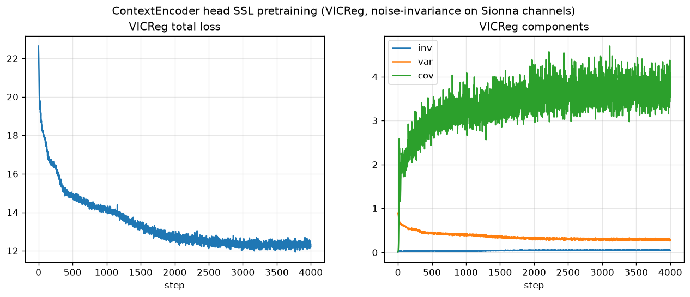

*VICReg pretraining: total loss 22.6 → 12.3; variance term drops and stabilizes (no collapse).*

Linear-probe verification (6 location clusters):

| Probe | Random head | Trained head |
| ----- | ----------- | ------------ |
| Clean location accuracy | 0.967 | 0.906 |
| **Noise-robust (test @ 10 dB SNR)** | **0.517** | **0.911** |

The trained head is dramatically more **noise-robust (+0.39 absolute)** — exactly what the
objective targets — confirming it learned a task-useful, not random, representation.

### Module 2 — TargetEncoder  (`o_{t+k} → z̃`, EMA + stop-grad)

The target the predictor learns to match. It is a **deep copy of the context encoder** whose
weights are an **exponential moving average** of the online encoder and which receives **no
gradient** (stop-grad) — the standard JEPA/BYOL mechanism that prevents representation collapse.
There is no separate model to download: in JEPA the target *is* a slow copy of the online encoder.
EMA only tracks the trainable head (the frozen LWM is identical in both).

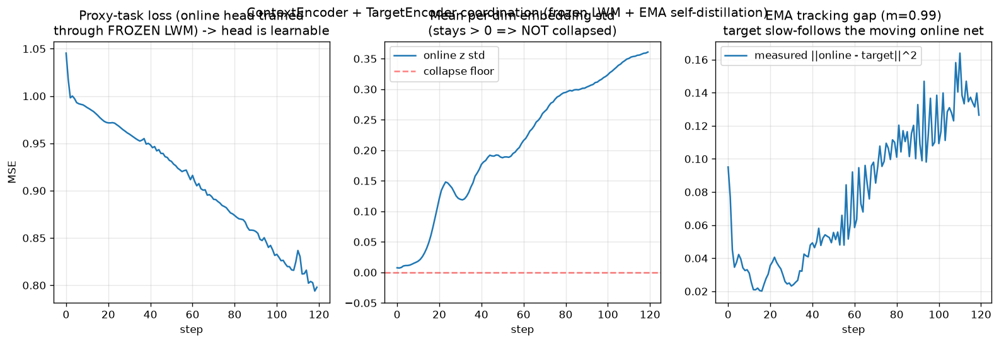

*Context ↔ Target coordination (self-distillation on real channels, run on A100): the predictive
loss decreases, the embedding std stays well above the collapse floor (**no collapse**), and the
online/target EMA gap tracks the moving online network.*

Rigorous review caught and fixed two real bugs here: (a) `train()` was re-enabling the frozen
LWM's dropout (encoder became stochastic); (b) `trainable_parameters()` used `id()` that broke
after `deepcopy`. Both fixed, with regression tests. 9 dedicated coordination tests verify
stop-gradient isolation, EMA lag-then-track, anti-collapse, and momentum edge cases.

### Module 3 — SelectionNet  (`a_t → A_t, B_t, C_t, Δ_t`)

Generates the **input-dependent** parameters that make the SSM *selective* (Mamba-style). A small
MLP trunk with four heads, using **Mamba/S4-style initialization**:

- `A_t = −softplus(·)` — guaranteed negative (stable) continuous-time poles, for any action.
- `Δ_t = softplus(·)` — positive step, initialized **log-uniform in `[dt_min, dt_max]`** (a spread
  of timescales) via the inverse-softplus trick.
- `A` bias targets `−1, −2, …, −state_dim` — a HiPPO-like spread of decay rates.

Tests verify `A<0` and `Δ>0` everywhere, the init ranges, **selectivity** (different actions →
different parameters), gradient flow, and numerical stability on extreme inputs.

### Module 4 — SelectiveSSM  (`[x_t; a_t] → z_t`)

The temporal backbone: a **diagonal, ZOH-discretized selective scan**.

```
Ā_t = exp(Δ_t · A_t)              # |Ā_t| < 1 because A_t < 0  → stable
B̄_t = (Ā_t − 1)/A_t · B_t         # zero-order hold
h_t = Ā_t ⊙ h_{t-1} + B̄_t ⊙ u_t   # u_t = Linear([x_t ; a_t])
z_t = out_proj(LN(C_t ⊙ h_t + D ⊙ u_t))
```

Implemented as a sequential scan (correctness first). It exposes a `step()` method that reuses the
*exact* recurrence, so the upcoming Predictor's rollout will match `forward` bit-for-bit. Tests
verify: the scan **matches a hand-computed reference recurrence** (1e-6), `forward == step()`
rollout (1e-5), stability over T=200, causality, and gradient flow into the SelectionNet. The full
pipeline `o → x → z` is verified end-to-end.

---

### Module 5 — Predictor  (`(z_t, planned actions) → ẑ_{t+k}`)

The imagination step: roll the latent `k` steps into the future from `z_t` and **planned actions
only**. Two mistakes we explicitly avoided: (1) **no information leak** — the future is unobserved,
so the rollout is driven by actions, never by future observations (naively reusing the SSM's
observation-driven `step()` would let the model cheat); (2) the output lives in **`embed_dim`**
(the target-encoder space the JEPA loss compares against), not SSM-latent space — guarded by a
test that makes the two dimensions unequal.

The predictor predicts a **residual** on top of the present (`residual_prediction`, default on),
with the output layer **zero-initialized** so it *starts exactly at persistence* and learns only the
motion-driven correction.

**Results — a real win, after fixing the formulation.** A naive first attempt (uninformative
power-proxy action, sub-wavelength motion, prediction in LWM's noise-invariant embedding space) lost
to persistence: the channel barely moved and there was nothing to condition on. We diagnosed it and
fixed three things:

1. **Velocity as the action** — the actual physical control driving channel evolution (not a power
   proxy).
2. **Larger inter-frame motion** (0.15 m/step ≈ λ) so the channel decorrelates enough to be worth
   predicting.
3. **Predict in raw channel space**, residual-on-present, with per-channel standardization (so the
   ~15× cross-scene scale spread doesn't dominate the loss) and dropout.

On a **12,000-sequence, 5-scene held-out** test, the predictor now **beats persistence**:

| | predictor | persistence (echo present) | linear extrapolation |
| --- | --------- | -------------------------- | -------------------- |
| held-out NMSE | **0.315** | 0.420 | 1.260 |

**1.33× better than persistence**, while linear extrapolation is far *worse* (1.26) — confirming the
channel's motion is **nonlinear phase rotation** that only a learned, velocity-conditioned model
captures. This is the evidence the world model learned genuine channel dynamics. (Repro:
`scripts/gen_sionna_actions.py` + `scripts/train-raw-predictor.py`.)

**These corrections flow through the full pipeline.** Feeding the same fixes (velocity actions +
per-channel standardized inputs, via `wireless_data/ShardDataset`) into the complete `SSWM` — which
predicts in LWM's embedding space — the in-pipeline predictor now also **beats persistence: 1.15×**
(held-out NMSE 0.0236 vs 0.0271, batch-mean 0.100), on the same 12k/5-scene split. The win is
smaller than the raw-space model because LWM's noise-invariance compresses present and future
embeddings together, but it is a genuine improvement of an already-strong baseline on a frozen
backbone. (Repro: `scripts/train-sswm-scaled.py`.)

### Integration — the full SSWM (`implementation/sswm.py`)

All five modules are wired into one model that runs a complete JEPA step exactly as the figure:
`o → context encoder → x → SelectiveSSM → z`; then `z_t` + planned actions → Predictor → `ẑ_{t+k}`,
compared against `target_encoder(o_{t+k})`. The **SelectionNet is shared** between the SSM and the
Predictor so the encode-path and imagination-path dynamics are consistent. 10 integration tests
verify shared-parameter wiring, **stop-gradient isolation** (target gets no gradient), anchor
bounds, loss decrease, and no-collapse over a training run.

## 6. Where everything ran

- **Local**: macOS, `wireless/` virtualenv, CPU correctness tests.
- **GPU**: Amazon Greenland **p4d.24xlarge (8× A100-40GB)**, accessed via SSM tunnel
  (`scripts/`). All modules run on CUDA; Sionna RT generates channels on the GPU; the head SSL
  pretraining fans data generation across all 8 GPUs.

Reproduce the GPU validation and pretraining:

```bash
./scripts/greenland-auth.sh          # interactive Midway auth (laptop)
./scripts/greenland-connect.sh tunnel
./scripts/greenland-sync.sh up
ssh -p 1057 greenland-user@localhost
#   on the box:
python scripts/gpu-validate-encoders.py            # modules 1+2 on GPU
python scripts/validate-on-sionna.py               # real-data validation
bash   scripts/run-parallel-pretrain.sh 256 4000   # 8-GPU data gen + head pretrain
```

---

## 7. Next steps

- **Module 6 — TaskHeads**: channel-estimation NMSE vs. LS/MMSE, plus reward/policy probes on `z_t`.
- **Full-scale JEPA training**: more scenes/diversity, VICReg regularizer folded into the loss to
  remove the partial-collapse pressure seen in the small-scale predictor run.

See `implementation/implementation.md` for the full milestone plan, and each module's `README.md`
for component-level detail.
